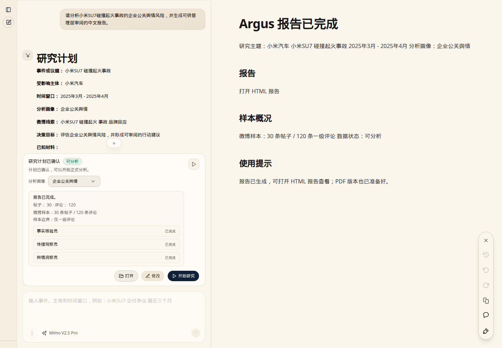

# Argus Reputation Intelligence

Argus Reputation Intelligence is an open-source, event-based reputation research system. It helps teams turn public context and Weibo-focused evidence into structured Chinese research reports for review.

Argus 声誉智能是一个开源的事件型声誉研究系统，用于把公开事件线索和微博样本证据整理成可审阅的中文研究报告。

## Product Preview / 产品预览



Argus turns a concrete public event into a research plan, prepares public Weibo evidence, runs a multi-engine analysis chain, and produces reviewable Chinese executive reports for analyst inspection.

Argus 将具体公共事件转化为研究计划，整理公开微博证据，运行多引擎分析链路，并生成可审阅的中文高管简报，便于分析师核查。

[Watch the workbench walkthrough](assets/demo/argus-curated-live-demo.mp4)

The video focuses on the analyst workbench: entering an event, reviewing the research plan, selecting a profile, starting analysis, and reaching the report-ready state. The final report itself is shown through the sanitized sample outputs below.

视频重点展示分析工作台：输入事件、查看研究计划、选择画像、启动分析，并到达报告完成入口。最终报告内容通过下方已脱敏样例产出展示。

### Example outputs / 样例产出

- [Artist/public-figure report: Wang Hedi profile](sample_reports/wang-hedi-artist-profile/report.html): executive brief, evidence boundary, reputation risk framing, and action recommendations.
- [Enterprise PR report: Xiaomi SU7 response](sample_reports/xiaomi-su7-enterprise-pr/report.html): incident framing, fact tiers, risk topics, sentiment evidence, and response recommendations.

## What It Does / 项目能力

- Guides an analyst from intake to a confirmed research plan.
- Uses configurable public web search and TikHub-backed Weibo data preparation.
- Runs the restored BettaFish multi-engine chain: Query, Media, Insight, Forum, and Report.
- Produces HTML, Markdown, and PDF reports.
- Includes sanitized sample reports for artist/public-figure and enterprise PR scenarios.

- 引导分析师从事件录入进入确认后的研究计划。
- 支持可配置的公开网页搜索，以及基于 TikHub 的微博数据准备路径。
- 运行恢复后的 BettaFish 多引擎链路：事实核验、传播观察、舆情洞察、研判主持和报告生成。
- 产出 HTML、Markdown 和 PDF 报告。
- 内置已脱敏的明星/公众人物与企业公关样例报告。

## When To Use It / 适用场景

Argus is designed for concrete public events, not broad brand monitoring. Good inputs usually include an affected subject, a specific issue or controversy, and a time window.

Argus 面向具体公共事件分析，而不是泛泛的品牌监控。较好的输入通常包含：受影响主体、具体议题或争议、时间窗口。

Examples:

- Artist/public-figure reputation review after a viral controversy.
- Enterprise PR review after a product, service, safety, or communications incident.
- Evidence-backed Chinese report drafting for analyst review.

示例：

- 明星或公众人物争议后的声誉复盘。
- 企业在产品、服务、安全或沟通事件后的公关研判。
- 为分析师生成带证据边界的中文报告初稿。

## Repository Map / 仓库结构

- `apps/argus-saas/`: Next.js / Vercel AI SDK chat frontend.
- `app.py`: Flask backend API and workflow entrypoint.
- `downstream/weibo_data/` and `utils/weibo_data_prep.py`: Weibo data preparation path.
- `QueryEngine/`, `MediaEngine/`, `InsightEngine/`, `ForumEngine/`, `ReportEngine/`: analysis and report chain.
- `sample_reports/`: sanitized HTML, Markdown, and PDF examples.
- `.env.example`: local configuration template.

## Quick Start / 快速开始

Backend:

```bash
python3.11 -m venv .venv
.venv/bin/python -m pip install -U pip
.venv/bin/python -m pip install -r requirements.txt
```

Frontend:

```bash
cd apps/argus-saas
pnpm install
```

Configure environment variables:

```bash
cp .env.example .env
```

Add your own OpenAI-compatible model provider keys, search provider keys, database URL, and TikHub key if you want live Weibo data preparation. Never commit `.env`.

配置环境变量：

```bash
cp .env.example .env
```

按需填入你自己的 OpenAI-compatible 模型服务、搜索服务、数据库和 TikHub 配置。不要提交 `.env`。

Run local checks:

```bash
PYTHONPATH="$(pwd)/ReportEngine/utils:${PYTHONPATH:-}" TMPDIR=/tmp TMP=/tmp TEMP=/tmp .venv/bin/python -m pytest -q
```

```bash
cd apps/argus-saas
TMPDIR=/tmp TMP=/tmp TEMP=/tmp pnpm exec tsc --noEmit
```

## Configuration Notes / 配置说明

Argus keeps a few legacy environment variable names, including `BETTAFISH_BACKEND_URL`, because parts of the adapted frontend and demo scripts still use those names for compatibility. Treat them as Argus backend settings in this repository.

Argus 保留了少量历史环境变量名，例如 `BETTAFISH_BACKEND_URL`。这是为了兼容改造后的前端和本地 demo 脚本；在本仓库中可以把它们理解为 Argus backend 配置。

The repository does not include provider keys, raw crawl data, runtime databases, logs, or local report output directories.

本仓库不包含 provider key、原始爬取数据、运行时数据库、日志或本地报告输出目录。

## Sample Reports / 样例报告

See `sample_reports/` for sanitized output examples:

- `wang-hedi-artist-profile/`
- `xiaomi-su7-enterprise-pr/`

Each sample includes HTML, Markdown, and PDF outputs. They demonstrate report structure and product behavior, not complete public-opinion coverage.

`sample_reports/` 中包含已脱敏的样例输出：

- `wang-hedi-artist-profile/`
- `xiaomi-su7-enterprise-pr/`

每个样例包含 HTML、Markdown 和 PDF。它们用于展示报告结构和产品行为，不代表完整舆情覆盖。

## Project Origin / 项目来源

Argus is derived from the upstream BettaFish project and preserves its GPLv2 license foundation. Major parts of the multi-engine public-opinion analysis architecture are adapted from BettaFish. See `NOTICE.md` for attribution and third-party notes.

Argus 派生自上游 BettaFish 项目，并保留 GPLv2 许可证基础。多引擎舆情分析架构的重要部分来自 BettaFish 的改造。归属和第三方说明见 `NOTICE.md`。

## Security / 安全

Do not commit API keys, `.env` files, raw provider responses, crawl outputs, runtime databases, logs, caches, or private local paths. See `SECURITY.md`.

不要提交 API key、`.env`、原始 provider 响应、爬取结果、运行时数据库、日志、缓存或本地私有路径。详见 `SECURITY.md`。

## License / 许可证

This project is released under GPLv2. Upstream BettaFish attribution is preserved in `NOTICE.md`.

本项目以 GPLv2 发布，并在 `NOTICE.md` 中保留 BettaFish 上游归属说明。
